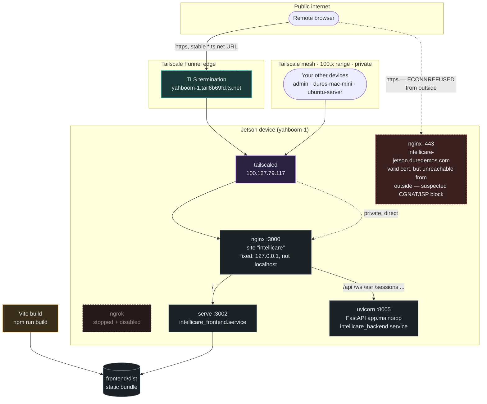

# Deployment


## Development

### Backend


```bash
cd /idata/intellicare_uat/backend
uv --project backend run uvicorn app.main:app --app-dir backend --host 0.0.0.0 --port 8005 --reload --reload-dir app --reload-exclude "backend/.venv/*"  --ws websockets-sansio
```

### Frontend

```bash
cd /idata/intellicare_uat/frontend
npm install
npm run dev
```


## Production

Edit env variables to jetson in `backend/.env`:
```bash
DEPLOYMENT_MODE=jetson
```

Edit `config.py`:
```bash
DEPLOYMENT_MODE: Literal["laptop", "jetson", "server"] = "jetson"
```

```bash
cd /idata/intellicare_uat/backend
uv run uvicorn app.main:app --host 0.0.0.0 --port 8005  --ws websockets-sansio
```

Run backend as a permanent service:
```bash
sudo vim /etc/systemd/system/intellicare_backend.service
```

```bash
[Unit]
Description=Intellicare Backend (FastAPI + Uvicorn)
After=network.target

[Service]
User=jetson
Group=jetson
WorkingDirectory=/idata/intellicare_uat/backend
ExecStart=/idata/intellicare_uat/backend/.venv/bin/uvicorn app.main:app --host 0.0.0.0 --port 8005  --ws websockets-sansio

Restart=always
RestartSec=5
Environment=PYTHONUNBUFFERED=1

[Install]
WantedBy=multi-user.target
```

Similarly for frontend:
```bash
sudo vim /etc/systemd/system/intellicare_frontend.service
```

```bash
[Unit]
Description=Intellicare Frontend React App
After=network.target

[Service]
Type=simple
User=jetson
Group=jetson
WorkingDirectory=/idata/intellicare_uat/frontend

Environment=PATH=/usr/local/bin:/usr/bin:/bin

ExecStart=/usr/bin/serve -s dist -l tcp://0.0.0.0:3002

Restart=always
RestartSec=5

[Install]
WantedBy=multi-user.target
```

Now enable and run these services:  
```bash
sudo systemctl daemon-reload
sudo systemctl enable --now intellicare_backend.service
sudo systemctl enable --now intellicare_frontend.service
sudo systemctl status intellicare_backend.service --no-pager
sudo systemctl status intellicare_frontend.service --no-pager
```

Make sure that you have the correct `VITE_API_URL` set in `frontend/.env`.

Rebuild frontend:  
```bash
cd /idata/intellicare_uat/frontend
npm run build
sudo systemctl restart intellicare_frontend.service
```

## Nginx

Add configurations for intellicare app:
```bash
sudo vim /etc/nginx/sites-available/intellicare
```

```bash
server {
    listen 3000;

    server_name _;

    # Backend API + top-level routers that aren't under /api
    location ~ ^/(api|analytics|sessions|dhis2-sync|dhis2-configs|field-corrections|system-config|config|forms|asr) {
        proxy_pass http://127.0.0.1:8005;
        proxy_http_version 1.1;
        proxy_set_header Upgrade $http_upgrade;
        proxy_set_header Connection "upgrade";
        proxy_set_header Host $host;
        proxy_set_header X-Real-IP $remote_addr;
    }

    # WebSocket
    location /ws {
        proxy_pass http://127.0.0.1:8005;
        proxy_http_version 1.1;
        proxy_set_header Upgrade $http_upgrade;
        proxy_set_header Connection "upgrade";
        proxy_set_header Host $host;
    }

    # Frontend
    location / {
        proxy_pass http://127.0.0.1:3002;
        proxy_http_version 1.1;
        proxy_set_header Upgrade $http_upgrade;
        proxy_set_header Connection "upgrade";
        proxy_set_header Host $host;
        proxy_set_header X-Real-IP $remote_addr;
    }
}
```

```bash
sudo ln -s /etc/nginx/sites-available/intellicare /etc/nginx/sites-enabled/
```

Restart nginx:  
```bash
sudo nginx -t
sudo systemctl restart nginx
```

## Tailscale

We use Tailscale funnel to create a public tunnel:  
```bash
sudo tailscale set --operator=jetson
tailscale funnel --bg 3000
```
This will a public url which does not rotate. Use this url for UAT purposes.

Intellicare Infra map would look like this:  


