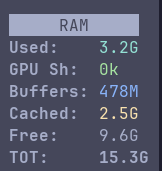
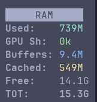
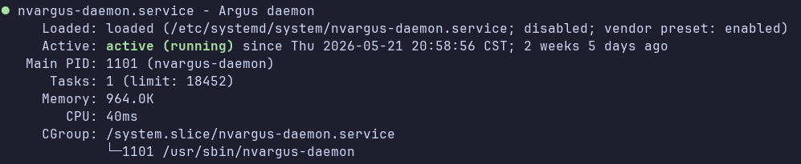

# Optimizations

## RAM optimization

### Disable Desktop GUI

Free memory if Ubuntu Desktop GUI is not needed:  
```bash
sudo init 3 # stop the desktop
sudo init 5 # restart the desktop
```
This saves ~200-800MB, sometimes from RAM, sometimes from SWP.



Clear Cache if a fresh prod run is needed:
```bash
jtop
4
c
```
This will open jtop, goto `4MEM` option and clear cache. Kills ollama and other background daemons. ~800MB remains, rest is cleared.



To persist this across reboots:  
```bash
sudo systemctl set-default multi-user.target
```
and re-enable it by:  
```bash
sudo systemctl set-default graphical.target
```

### Disable Camera Processes

If camera feed is not needed, disable it to free RAM.

```bash
sudo systemctl disable nvargus-daemon.service
sudo systemctl status nvargus-daemon.service
```



### Increase Swap Size

Large model might give OOM errors and containers might need more swp size.  
Disable RAM compression and increase swap size for this reason.  
Jetson might come with `8GB.swap`, if so, this needs to be replaced with `16GB.swap` and that too in the partition where `/idata` is mounted (which has more space) than partition with `/` mount point.

```bash
jetson@yahboom:/$ sudo swapoff /var/8GB.swap
jetson@yahboom:/$ sudo rm -f /var/8GB.swap
jetson@yahboom:/$ sudo systemctl stop nvzramconfig
jetson@yahboom:/$ sudo systemctl disable nvzramconfig
jetson@yahboom:/$ sudo swapoff /dev/zram*
Removed /etc/systemd/system/multi-user.target.wants/nvzramconfig.service.
jetson@yahboom:/$ sudo fallocate -l 16G /idata/16GB.swap
jetson@yahboom:/$ sudo chmod 600 /idata/16GB.swap
jetson@yahboom:/$ sudo mkswap /idata/16GB.swap
Setting up swapspace version 1, size = 16 GiB (17179865088 bytes)
no label, UUID=1279a20a-74ca-492f-a912-eeda0eee8f1e
jetson@yahboom:/$ sudo swapon /idata/16GB.swap
```

Make this change persist by adding the following line to `/etc/fstab` and comment out lines referring to `/var/8GB.swap`:  
```bash
/idata/16GB.swap none swap sw 0 0
```

Check if we were succesfull:
```bash
jetson@yahboom:/$ swapon --show
NAME             TYPE SIZE USED PRIO
/idata/16GB.swap file  16G   0B   -2
```

Don't hesitate to double the swap size in future if OOM for LLMs is an issue. But if a software needs swap all the time, it will be slower since swap is on SSD.


#TODO: setup docker properly : https://www.jetson-ai-lab.com/tutorials/ssd-docker-setup/
#TODO: move uv, cache, hf, ollama etc to /idata