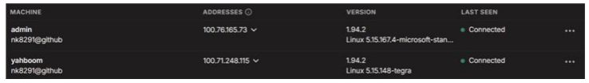

# Setup

## CUDA driver update

Fetch latest upgrades: `sudo apt update && sudo apt upgrade`  

Then update the drivers: `sudo ubuntu-drivers install`  

Reboot jetson: `sudo reboot`

## Storage

### Project Mount Point

Rename any mount points `/mnt/ssd` to `/idata`:  
```bash
sudo mkdir /idata
sudo umount /mnt/ssd
``` 

Make sure that `lsblk` command shows blank under `MOUNTPOINTS` column.
If it doesn't, perform a lazy unmount and check `lsblk` again:  
```bash
sudo umount -l /mnt/ssd
```

Edit `/etc/fstab` and rename `/mnt/ssd` to `/idata` and then mount `/idata`:  
```bash
sudo mount /idata
```

Clear the system cache and reload:  
```bash
sudo systemctl daemon-reload
sudo mount -a
```

### HF and UV Cache

In `~/.bashrc` add following lines:  
```bash
export HF_HOME=/idata/.cache/huggingface
export UV_CACHE_DIR=/idata/.cache/uv
```
Refresh your terminal : `source ~/.bashrc`

Create home and cache dirs in `/idata` for HF and UV:  
```bash
mkdir -p $HF_HOME
mkdir -p $UV_CACHE_DIR
```

## SSH

### Jump host

We can make the server our jumphost to jetson and save the configurations in our local `~/.ssh/config`. This will allow us to directly SSH into jetson:

```bash
Host <server_name>
    Hostname <server IP>
    User <server login username>
    IdentityFile ~/.ssh/id_rsa

Host jetson
    HostName <jetson IP>
    User <jetson login username>
    IdentityFile ~/.ssh/id_rsa
    ProxyJump <server_name>
```
This assumes that you used `id_rsa` as your public keys. Since you copied your public keys in `authorized_keys` on server too, jetson will authenticate you from those keys.

Save the server public keys to jetson `~/.ssh/authorized_keys`, run the following command on the server:
```cmd
ssh-copy-id <jetson login username>@<jetson IP>
```

## Network

### Requesting IP

On jetson, request a new IP from the DHCP server after a fresh reboot: 
```cmd
sudo dhclient eno1
```

Check Tailscale, whether jetson(yahboom user) has been given a new IP: 


### Autoconnecting to ethernet on device restart

Check if NetworkManager is running: `systemctl status NetworkManager`  
 
If it is not running:  
```bash
sudo systemctl start NetworkManager
sudo systemctl enable NetworkManager
```

If it is already running, find the ethernet connection name: `nmcli connection show`  

The name will likely be `eno1`, then:  
```bash
sudo nmcli connection modify "ethernet_name" connection.autoconnect yes
sudo nmcli connection modify "ethernet_name" ipv4.method auto
```

### Setting DNS

In case of jetson does not reach a DNS server:  

1. Sudo open `/etc/systemd/resolved.conf` in your preferred text editor.  
2. Under the `[Resolve]` section, uncomment and modify the lines:  

```bash
DNS=1.1.1.1 8.8.8.8
FallbackDNS=1.0.0.1 8.8.4.4
```

3. Restart the service: sudo systemctl restart systemd-resolved

Once you've made your changes, test your DNS: `resolvectl status`

## Tools

### jtop

Intall using `pip`: 
```bash
sudo pip3 install jetson-stats
sudo systemctl restart jtop.service
```
Jetson might or might not need a reboot after this.

### dust

Convenient `du` wrapper in rust:  
```bash
curl -sSfL https://raw.githubusercontent.com/bootandy/dust/refs/heads/master/install.sh | sh
```


### Docker

Configure docker to run gpu-accelerated containers from nvidia primarily.
Assuming docker, nvidia-container is preinstalled and user is added to docker group, run:  
```bash
sudo nvidia-ctk runtime configure --runtime=docker
sudo systemctl restart docker
```

Add nvidia as the default runtime for docker:
```bash
sudo vim /etc/docker/daemon.json
```
Edit the file:
```bash
{
    "runtimes": {
        "nvidia": {
            "path": "nvidia-container-runtime",
            "runtimeArgs": []
        }
    },
    "default-runtime": "nvidia"
}
```
Now restart:
```bash
sudo systemctl daemon-reload && sudo systemctl restart docker
```

Now move the docker data dir to `/idata` that has more space:

```bash
sudo du -csh /var/lib/docker/ && \
sudo mkdir /idata/docker && \
sudo rsync -axPS /var/lib/docker/ /idata/docker/ && \
sudo du -csh /idata/docker/
```

We will also move the data dir to `/idata`:
```bash
sudo systemctl stop docker
sudo systemctl stop docker.socket
sudo systemctl stop containerd
sudo umount -f /var/lib/docker/overlay2/*/*/merged
sudo umount -f /var/lib/docker/containers/*/mounts/shm
sudo du -csh /var/lib/docker && sudo rsync -axPS /var/lib/docker/ /idata/docker/ && sudo du -csh /idata/docker/
```

In case `rsync` failes and the data that cannot be transferred is very small, ignore those errors by giving flag on the above `rsync` command: `-ignore-errors` and rerun the command.

Edit the `sudo vim /etc/docker/daemon.json` file again:
```bash
{
    "runtimes": {
        "nvidia": {
            "path": "nvidia-container-runtime",
            "runtimeArgs": []
        }
    },
    "default-runtime": "nvidia",
    "data-root": "/idata/docker"
}
```

Rename old data dir and restart docker daemon:  
```bash
sudo mv /var/lib/docker /var/lib/docker.old
sudo systemctl daemon-reload && \
sudo systemctl restart docker && \
sudo journalctl -u docker
```

### Ollama

We will install jetson optimized ollama container:  
```bash
docker pull dustynv/ollama:r36.4.3
```
